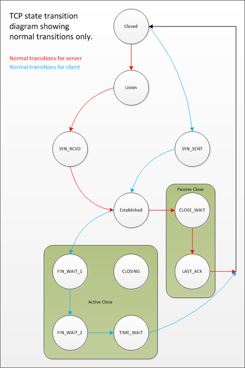
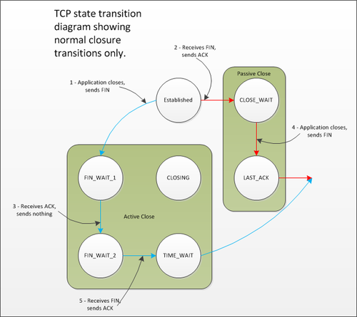
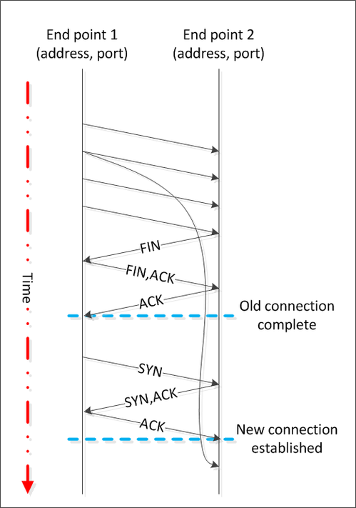

# TCP相关细节

## TIME_WAIT 及其对协议和可扩展客户端服务器系统的设计含义
> 在“UNIX 网络编程”第三版（Stevens 等人）第 203 页中，它也指出您存在数据损坏的风险。考虑阅读 RFC 1337，您可以在其中了解为什么 TIME_WAIT 是您的朋友。
要了解为什么TIME_WAIT状态是我们的朋友，请阅读 Stevens 等人的“UNIX 网络编程”第三版（第 43 页）中的第 2.7 节。

* https://stackoverflow.com/questions/3757289/when-is-tcp-option-so-linger-0-required
* http://www.serverframework.com/asynchronousevents/2011/01/time-wait-and-its-design-implications-for-protocols-and-scalable-servers.html
* https://docs.microsoft.com/zh-cn/windows/win32/api/winsock/nf-winsock-closesocket?redirectedfrom=MSDN
* http://www.4e00.com/blog/linux/2019/03/27/tcp-option-so-linger.html
* https://jishuin.proginn.com/p/763bfbd6adcf

> TIME_WAIT可能影响系统可扩展性的原因是TCP连接中一个完全关闭的套接字将保持该TIME_WAIT状态大约 4 分钟。
如果许多连接被快速打开和关闭，那么 TIME_WAIT 中的套接字可能会开始在系统上累积；您可以TIME_WAIT使用netstat查看套接字。
一次可以建立的套接字连接数量是有限的，限制此数量的因素之一是可用本地端口的数量。

> 如果 TIME_WAIT 中有太多套接字，您会发现很难建立新的出站连接，因为缺少可用于新连接的本地端口。但是为什么 TIME_WAIT 存在呢？

* TCP 状态转换图仅显示正常转换

* 只显示正常闭锁的TCP状态转换图

* TIME_WAIT 状态有两个原因。第一个是防止来自一个连接的延迟数据段被误解为后续连接的一部分。任何在连接处于 2MSL 等待状态时到达的数据段都将被丢弃。

* TIME_WAIT 状态的第二个原因是为了可靠地实现 TCP 的全双工连接终止
> 如果来自端点 2 的最终 ACK 被丢弃，则端点 1 将重新发送最终的 FIN。

# 何时使用超时为 0 的 SO_LINGER

> 同样，根据“UNIX 网络编程”第三版第 202-203 页，SO_LINGER在调用之前设置超时 0, close()将导致正常终止序列无法启动。
相反，设置此选项并调用的对等方close()将发送一个RST（连接重置），指示错误情况，这就是另一端将如何感知它。您通常会看到诸如“对等方重置连接”之类的错误。
因此，在正常情况下，在服务器应用程序中SO_LINGER调用之前设置超时0是一个非常糟糕的主意, close()- 从现在开始称为异常关闭。
但是，在某些情况下，无论如何都需要这样做：
如果您的服务器应用程序的客户端行为不端（超时、返回无效数据等），则中止关闭是有意义的，以避免陷入CLOSE_WAIT或结束TIME_WAIT状态。
如果您必须重新启动当前有数千个客户端连接的服务器应用程序，您可以考虑设置此套接字选项以避免TIME_WAIT（close()从服务器端调用时）出现数千个服务器套接字，因为这可能会阻止服务器为新的客户端连接获取可用端口重启后。
在上述书中的第 202 页，它特别指出：“在某些情况下，需要使用此功能来发送中止关闭。一个例子是 RS-232 终端服务器，它可能会在CLOSE_WAIT尝试将数据传送到卡住的终端时永远挂起端口，但如果可以RST丢弃挂起的数据，则会正确重置卡住的端口。”
> 
# 延迟发送（Nagle 算法和发送缓冲区）和延迟接收（接收缓冲区）
https://mp.weixin.qq.com/s?__biz=Mzg5NDY2MDk4Mw==&mid=2247486377&idx=1&sn=bdc4b8b71559193b29aa0f54b95973db&scene=21#wechat_redirect